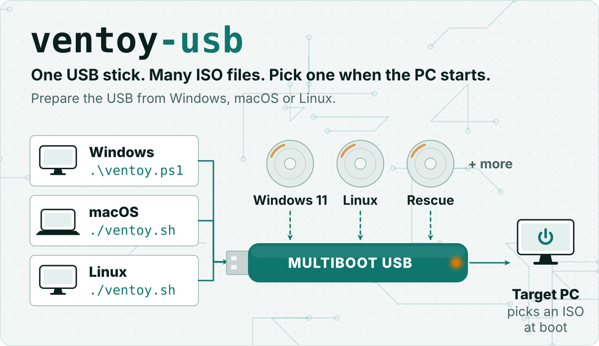

<a href="docs/assets/hero-light.svg">
<picture>
  <source media="(prefers-color-scheme: dark)" srcset="docs/assets/hero-dark.svg">
  
</picture>
</a>

<p align="center">
  <a href="https://github.com/erickb336/ventoy-usb/actions/workflows/validate.yml"></a>
  
  
  <a href="LICENSE"></a>
</p>

# Ventoy USB Setup for Windows, macOS and Linux

Create a multiboot USB and copy installer ISOs using **native PowerShell on Windows**, **native Bash on macOS** (with the Mactoy app to install Ventoy) or the existing **Bash scripts on Linux**. Install Ventoy once; add ISOs later without reinstalling it.

> [!WARNING]
> **Creating a Ventoy USB erases every partition and file on the selected USB disk. Back it up first.** Adding an ISO does not reinstall Ventoy. Creating the USB does not install Windows or erase your PC; that is a separate operation on the target PC.

**Contents:** [Pick your computer](#pick-your-computer) · [The whole journey](#the-whole-journey) · [Windows](#windows-quick-start) · [macOS](#macos-quick-start) · [Linux](#linux-quick-start) · [The verified copy](#the-verified-copy) · [Windows 11 media](#windows-11-installation-media) · [Booting](#booting-and-clean-installation) · [Secure Boot](#secure-boot) · [Troubleshooting](#troubleshooting) · [Development](#development-and-safe-validation)

## Pick your computer

This graphic shows the script to run on each computer, and the two options of the menu.

<a href="docs/assets/pick-light.svg">
<picture>
  <source media="(prefers-color-scheme: dark)" srcset="docs/assets/pick-dark.svg">
  
</picture>
</a>

Then go to your quick start: [Windows](#windows-quick-start), [macOS](#macos-quick-start) or [Linux](#linux-quick-start).

### Platform compatibility

| Computer running this utility | Supported? | Entry point |
| --- | --- | --- |
| Windows 10/11 (Intel/AMD) | Yes, native PowerShell | `ventoy.ps1` |
| Linux | Yes, Bash and Linux disk utilities | `./ventoy.sh` |
| macOS 13.5 or later (Apple silicon and Intel) | Yes: Mactoy installs Ventoy, and this utility copies ISOs natively | `./ventoy.sh` |

`./ventoy.sh` detects macOS and starts `macos/ventoy-mac.sh`. The macOS path uses only built-in tools (`diskutil`, `plutil`, `shasum`, `df`, `open`) and never uses sudo. The Linux scripts need Linux tools such as `lsblk` and `udevadm`, so they do not run on macOS. This table describes the computer preparing the USB, not which operating systems or hardware can boot a particular ISO.

## The whole journey

This graphic shows the four steps from a blank USB to an installed PC, with Windows 11 as the example.

<p align="center">
<a href="docs/assets/journey-light.svg">
<picture>
  <source media="(prefers-color-scheme: dark)" srcset="docs/assets/journey-dark.svg">
  
</picture>
</a>
</p>

## Windows quick start

Prerequisites: Windows 10/11 on an Intel/AMD PC, Windows PowerShell 5.1 or PowerShell 7, the built-in Storage module, internet for installation, and a USB with enough room for your ISO. A 16 GB or larger USB is a practical choice for Windows 11. Git is only needed to clone; a downloaded repository ZIP works too.

### 1. Open an Administrator PowerShell window

Open **Start**, type **Windows PowerShell**, right-click it, and choose **Run as administrator**. Approve the Windows prompt. The window title should include **Administrator**. Opening a normal PowerShell window is not enough, even if your Windows account is an administrator.

### 2. Download the project and enter its folder

**Run each command separately, from top to bottom. Press Enter after each one.** Copy only the command, not the `PS C:\...>` prompt or Markdown backticks.

If you have Git and have not downloaded this project yet:

```powershell
git clone https://github.com/erickb336/ventoy-usb.git
```

Then:

```powershell
cd ventoy-usb
```

If you already have the project, do not clone again. Run `cd` with the actual folder containing `ventoy.ps1`. For example, replace the example path below with yours:

```powershell
cd "C:\path\to\ventoy-usb"
```

You can also download the repository ZIP from GitHub's **Code > Download ZIP**, extract it, and enter the extracted folder. Do not run the scripts from inside the ZIP.

Confirm you are in the correct folder:

```powershell
Get-Item .\ventoy.ps1
```

If this says the file cannot be found, correct the folder before continuing. An Administrator PowerShell window often starts in `C:\Windows\System32`, which is not this project's folder.

### 3. Start the utility

Run this single command from the project folder:

```powershell
powershell.exe -NoProfile -ExecutionPolicy Bypass -File ".\ventoy.ps1"
```

This command handles the common **running scripts is disabled** error for this process only. It does not permanently change your system execution policy and does not grant administrator rights; step 1 is still required. It cannot override organizational Group Policy. Only run scripts you have reviewed and trust.

If your execution policy already permits scripts, the shorter entry point also works:

```powershell
.\ventoy.ps1
```

### 4. Select the correct USB and confirm

Choose **1** to create a new Ventoy USB, or **2** to copy an ISO to an existing one without reinstalling Ventoy.


The next graphic is a tip for the selection and the erase confirmation.

<a href="docs/assets/tip-yes-light.svg">
<picture>
  <source media="(prefers-color-scheme: dark)" srcset="docs/assets/tip-yes-dark.svg">
  
</picture>
</a>

At **Select USB by list number**, enter the number in square brackets, **not the physical disk number or drive letter**. For example:

```text
[1]
Disk 3 | General UDisk | 58.59 GiB
Select USB by list number: 1
```

In this example, type `1`, not `3` or `D:`. Your USB's name, capacity and disk number may differ. A marketed 64 GB USB commonly appears as about 58.6 GiB.

If you are unsure which disk is your USB, stop with **Ctrl+C before confirming erasure**. Unplug the USB and run:

<details>
<summary><b>Not sure which disk is your USB? Identify it with Get-Disk</b></summary>


```powershell
Get-Disk | Format-Table Number, FriendlyName, BusType, @{Name='SizeGiB';Expression={[math]::Round($_.Size/1GB,1)}}, IsBoot, IsSystem
```

Plug it back in, wait a few seconds, and run the same command again. Identify the newly appearing disk and match its model and capacity. It should show `USB`, with `IsBoot` and `IsSystem` both `False`. Disconnect other external drives if that helps identify it. Disk numbers can change after reconnection, so rerun the utility and verify the current details.

</details>

For a new USB, the utility downloads and verifies Ventoy, then displays the physical disk again. Type uppercase **`YES` only after confirming the intended USB and backing up anything on it**. This erases every partition on that USB. Installation uses GPT and leaves Secure Boot support enabled. Do not unplug it while installation is running.

### 5. Add your Windows 11 or local ISO

After installation (or immediately for option 2), choose:

- **1 — Windows 11:** open Microsoft's official download page. Download the **Windows 11 Disk Image (ISO)** matching the target PC; use x64 for an Intel/AMD PC. Save the file to your computer and wait until the download finishes.
- **2 — Local ISO:** use an ISO you already downloaded.
- **3 — Skip:** finish without copying an ISO. You can rerun the utility with option 2 later.

When asked for the ISO path, paste the full file path, for example:

```text
"C:\Users\YourName\Downloads\Windows11.iso"
```

Replace the example with your actual filename. Spaces, brackets and optional surrounding double quotes are supported. Wait for copying and SHA-256 verification to finish, then safely eject the USB in Windows before unplugging it.

### How to tell what is happening

| Stage | Where to see progress |
| --- | --- |
| Downloading the Windows ISO | In your browser, press **Ctrl+J**. The utility cannot track this browser download. Wait until the browser says it is complete. |
| Terminal asks for an ISO path | The utility is waiting for you; no USB copy has started. Paste the completed file's path and press Enter. Do not double-click the ISO or start Windows Setup on this PC. |
| Downloading Ventoy | Terminal download activity indicator; PowerShell may also display received-byte progress. |
| Installing Ventoy | Terminal percentage when reported by the installer, otherwise a waiting indicator. |
| Copying the ISO | Terminal progress bar with percentage, GiB copied, average MiB/s and estimated time remaining. Speed and estimates can fluctuate. |
| Flushing / verifying | Separate flushing status and source/USB checksum progress bars. Copying reaching 100% does not mean verification is finished. |
| Finished | **ISO copied and SHA-256 verified.** You can now safely eject the USB. |


<details>
<summary><b>Windows safety details: disk checks, copy rules, ZIP downloads</b></summary>

Updates to the script apply on the next run. Let any current installation or copy finish. If Ventoy is already installed, select **2 — Add ISO to existing Ventoy USB** next time; do not reinstall just to get progress indicators.

The Windows path uses [Ventoy's supported CLI](https://www.ventoy.net/en/doc_windows_cli.html) with a physical disk number (`/PhyDrive:N`), not GUI automation or a destructive drive-letter command. It rejects non-USB, boot/system, offline, read-only and zero-size disks, and rechecks disk identity after confirmation. USB-attached external SSDs may still appear, even when Windows calls them fixed disks. Check their model, size and serial carefully. Keep the USB connected throughout the operation.

Copying requires the standard Ventoy partition layout on the selected disk, checks free space and FAT32 limits, refuses filename collisions, and uses a temporary file until checksum verification succeeds. This checks copy integrity, not ISO authenticity.

For a downloaded ZIP, use Properties > Unblock before extraction if needed. Do not change machine-wide execution policy for this utility.

</details>

## macOS quick start

Prerequisites: macOS 13.5 or later on Apple silicon or Intel, Terminal, and a USB with enough room for your ISO. Ventoy has no official macOS installer. To create a new Ventoy USB, this utility uses [Mactoy](https://github.com/cashcon57/mactoy), a free, open-source (MIT) app. The Mactoy project says that the app is signed and notarized. Mactoy is a young app with one maintainer, and it asks for Full Disk Access, so check the download before you open it (see option 1). Install Mactoy yourself; this utility never downloads or installs software.

### 1. Download the project and start the utility

Open **Terminal** and run these commands one at a time:

```bash
git clone https://github.com/erickb336/ventoy-usb.git
cd ventoy-usb
./ventoy.sh
```

The utility shows:

```text
Ventoy USB Setup (macOS)
[1] Create a new Ventoy USB (with Mactoy)
[2] Add ISO to existing Ventoy USB
```

### 2. Option 1: create a new Ventoy USB with Mactoy


The next graphic is a tip for the Mactoy download. Do these checks before you give Mactoy Full Disk Access.

<a href="docs/assets/tip-mactoy-light.svg">
<picture>
  <source media="(prefers-color-scheme: dark)" srcset="docs/assets/tip-mactoy-dark.svg">
  
</picture>
</a>

**Installing Ventoy erases every file on the USB that you choose. Back it up first.**

If Mactoy is in `/Applications` or `~/Applications`, the utility opens it. If not, it opens the [Mactoy releases page](https://github.com/cashcon57/mactoy/releases) in your browser. Download the `.dmg` file and its `.dmg.sha256` file from the same release.

**Check the Mactoy download before you give it Full Disk Access.** In Terminal, in the download folder (replace `<ver>` with the release version, for example `0.5.1`):

1. Run `shasum -a 256 Mactoy-<ver>.dmg`. Compare the result with the text in `Mactoy-<ver>.dmg.sha256`. If they are different, delete the file and do not open it.
2. Open the `.dmg` file and drag Mactoy to **Applications**.
3. Run `spctl -a -vv /Applications/Mactoy.app`. The result must show `accepted` and `source=Notarized Developer ID`. If it does not, delete Mactoy and do not open it.

Then, in Mactoy:

1. Connect the USB. Select its card in the sidebar. Check its name and size.
2. On the **Install Ventoy** tab, keep the defaults: version **Latest**, **MBR**, **Secure Boot** on.
3. If macOS asks, allow Mactoy in **System Settings > General > Login Items** (**Allow in the Background**).
4. If Mactoy asks for **Full Disk Access**, use its button to open System Settings and turn it on.
5. Confirm the erase only when the USB name and size are correct. Wait until Mactoy has finished.

Go back to Terminal and press **Enter**. The utility continues with option 2. To stop, press **Ctrl+C**.

### 3. Option 2: add an ISO to a Ventoy USB

The utility lists only external, physical, writable disks with the Ventoy layout: data partition 1 (exFAT or FAT32) and a 32 MiB `VTOYEFI` partition 2. Enter the number in square brackets, not the disk identifier:

```text
[1] /dev/disk4 | SanDisk Ultra | 57.30 GiB | data: Ventoy (exFAT)
Select USB by list number: 1
```

If the data partition is not mounted, the utility mounts it. Then choose:

- **1 — Windows 11:** opens Microsoft's download page. Choose the architecture of the target PC (x64 for an Intel or AMD PC). Watch progress in the browser's Downloads list (**Option-Command-L** in Safari or Chrome). Do not open the ISO.
- **2 — Local ISO:** use an ISO that you already have.
- **3 — Skip:** copy nothing.

At the path prompt, drag the ISO from Finder into the Terminal window and press **Enter**. You can also type the path, with or without quotes, for example `~/Downloads/Win11.iso`.

The utility copies the ISO with progress (percent, GiB copied, MiB/s, time left), mounts the USB again so that it reads the USB and not the cache, and compares the SHA-256 of the source and the copy. When you see **ISO copied and SHA-256 verified.**, the utility asks if it can eject the USB (default: no). Eject the USB before you unplug it.


See [The verified copy](#the-verified-copy) for each step of the copy.

## Linux quick start

Prerequisites: Bash, `curl`, `tar`, `grep`, `sed`, `awk`, `lsblk`, `sudo`, `udevadm`, `partprobe`, and standard mount/copy utilities. Installation needs sudo and internet access; your system must support mounting exFAT. On Debian/Ubuntu, `partprobe` is in the `parted` package.

```bash
git clone https://github.com/erickb336/ventoy-usb.git
cd ventoy-usb
./ventoy.sh
```

Run from the repository directory. If you downloaded a ZIP, restore permissions with:

```bash
chmod +x ventoy.sh ventoy-install.sh ventoy-add-isos.sh
```

You can also run the Linux scripts directly:

```bash
./ventoy-install.sh          # latest release, USB selection, YES confirmation
./ventoy-install.sh 1.1.17   # optional explicit version (example)
./ventoy-add-isos.sh         # interactive copy
./ventoy-add-isos.sh /mnt/ventoy ./isos
```

Select a whole USB device such as `/dev/sdb`, not `/dev/sdb1`. Check `lsblk -o NAME,TRAN,SIZE,MODEL,LABEL,MOUNTPOINT` before confirming. The installer uses force-install (`-I`), which erases existing Ventoy installations too. It offers ISO URL downloads and copying from a local directory. Only use trusted direct ISO URLs; download Windows ISOs manually because Microsoft links can expire.

The installer asks these questions, in this order:

1. `Enter USB device (e.g. /dev/sdb):` type the whole device.
2. `Type YES to continue:` type `YES` only after you check the device and back up its data.
3. `Do you want to download ISO files from URLs first? (y/N):` press `y` to give ISO URLs, separated by spaces.
4. `Continue? (y/n)` and then `Double-check. Continue? (y/n)`: Ventoy2Disk asks these two questions. Type `y` to both to install Ventoy. If you type `n`, the installer says "Ventoy was not installed" and stops.
5. `Optional: directory containing ISO files (leave empty to skip):` only when you did not download ISOs.

The installer saves each download under a name that ends in `.iso`. It removes the query (`?…`) and the fragment (`#…`) of the URL from the name, and adds `.iso` when the name does not end in `.iso`. When two URLs give the same name, it stops before any download.

`./ventoy-add-isos.sh` copies each `.iso` file of the folder (`.iso` in any case, as on Windows; not the hidden files) and checks its SHA-256, as on Windows and macOS (see [The verified copy](#the-verified-copy)):

- It never overwrites a file. When an ISO with the same name is already on the USB, it skips that ISO and tells you.
- It refuses an ISO that is larger than the free space, or larger than 4 GiB minus 1 byte on FAT32.
- At the end, it prints a summary: copied and SHA-256 verified, skipped, and failed. If an ISO failed, it exits with code 1, and `./ventoy-install.sh` shows a warning instead of "Ventoy USB is ready". An ISO that it skipped because it is already on the USB is not a failure.
- It reads the ISO as your user. It uses sudo only for the USB (write and read-back), and only when the mount is not writable by you (for example, a mount made by root). It then asks for your password once, before the first copy.

Linux keeps Ventoy's default partition style (MBR); the Windows path uses GPT. Which USB gets the ISOs:

- `./ventoy-install.sh` copies the ISOs only to the USB that it just installed. It uses the `Ventoy` partition of the device that you selected, never a Ventoy USB of another device. If that partition is not mounted, the script mounts it at a new folder in `/mnt` that only root can change, and unmounts it at the end.
- `./ventoy-add-isos.sh` (option 2) finds the USB by its `Ventoy` label. The mount point that you give must be the mount point of a file system with that label, or the script asks before it continues. When two or more Ventoy USBs are connected, it lists them and asks which one to use.
- The installer removes the downloaded ISOs only when no ISO failed and each download is on the USB. Otherwise it keeps them in their temporary folder, also when it stops before the copy. It shows the folder and how to copy the ISOs later.

## The verified copy

On Windows, macOS and Linux, option 2 copies each ISO in the same safe way. This graphic shows each step, and what happens after an error.

<p align="center">
<a href="docs/assets/copy-light.svg">
<picture>
  <source media="(prefers-color-scheme: dark)" srcset="docs/assets/copy-dark.svg">
  
</picture>
</a>
</p>

<details>
<summary><b>Copy rules in detail</b></summary>

Copying requires the standard Ventoy partition layout on the selected disk, checks free space and FAT32 limits, refuses filename collisions, and uses a temporary file until checksum verification succeeds. This checks copy integrity, not ISO authenticity.

Copy rules on macOS are the same as on Windows: it never overwrites a file, it checks free space and the FAT32 limit, it checks the disk identity again before it writes and after it mounts the USB again (if the USB mounts at a different folder, it continues there), it writes to a hidden temporary file, and it removes that file after an error or **Ctrl+C**. It also removes the hidden `._` file in which macOS keeps file attributes on exFAT and FAT32, so Ventoy does not list a `._<name>.iso` file.

Copy rules on Linux are the same, with these differences. It does not check the disk identity or the Ventoy partition layout: it checks only that the exact mount point that you give has the `Ventoy` label, and it does not check the disk again before it writes. It copies all the ISOs of a folder, one after the other. It skips an ISO whose name is already on the USB, and an error stops only that ISO; **Ctrl+C** stops all. It shows the progress of `dd` (bytes copied and speed). It reads the copy back with O_DIRECT, so that it reads the USB and not the page cache. If the file system does not support O_DIRECT, it drops the copy from the page cache, reads it again and prints a note. When `fincore` cannot confirm that no part of the copy stays in the cache, the note says so. If it cannot remove the temporary file, it tells you its name, so that you can delete it.

</details>

## Windows 11 installation media

The Windows 11 menu option opens [Microsoft's official download page](https://www.microsoft.com/software-download/windows11). Select **Download Windows 11 Disk Image (ISO)** and the architecture matching the target PC. Save it to the host PC, wait for completion, then paste its path into the prompt. The utility does not scrape temporary Microsoft download URLs. If the browser cannot open, use the printed URL manually. On Linux, download the ISO in your browser and place it in the ISO directory. On macOS, the menu works as on Windows; drag the finished file into Terminal.

Compare the ISO's SHA-256 against Microsoft's published checksum for your chosen download when available:

```powershell
Get-FileHash -Algorithm SHA256 -LiteralPath 'C:\path\Windows11.iso'
```

```bash
sha256sum /path/Windows11.iso      # Linux
shasum -a 256 ~/Downloads/Win11.iso # macOS
```

## Booting and clean installation

1. Safely eject the USB, insert it into the target PC and open its one-time boot menu (check the manufacturer's key).
2. Choose the UEFI USB entry. In Ventoy, select the Windows ISO and start in normal mode.
3. Back up needed files before deleting anything. In Windows Setup, identify the intended **internal physical disk**. To replace dual boot, remove its old Windows/Linux partitions only when ready to lose their contents, then install onto its unallocated space. Do not select the Ventoy USB as the destination.
4. After installation, boot Windows Boot Manager on the internal SSD instead of restarting the USB installer.

Two SSDs remain two physical devices. Removing Linux can reclaim space but does not merge both drives. A straightforward setup is Windows on one SSD and a data volume on the second. Identify and back up both disks before planning that later change. This utility does not modify internal SSDs or remove dual boot entries.

## Secure Boot

<details>
<summary><b>Secure Boot details</b></summary>

The Windows installer leaves Secure Boot support enabled by omitting `/NOSB`. It does not configure firmware or guarantee compatibility with every PC. Ventoy may require key enrollment on first boot; keys can change between releases. Follow the current [official Secure Boot instructions](https://www.ventoy.net/en/doc_secure.html). Some firmware requires its Microsoft third-party UEFI CA option. Ventoy's image validation policy is separate from enabling firmware Secure Boot; consult upstream instructions if you need strict validation.

</details>

## Troubleshooting

Open the list for the computer that prepares the USB.

<details>
<summary><b>Windows</b></summary>

| Problem | Action |
| --- | --- |
| Running scripts is disabled | From the project folder, run `powershell.exe -NoProfile -ExecutionPolicy Bypass -File ".\ventoy.ps1"`. No permanent policy change is needed. |
| `ventoy.ps1` is not recognized / cannot be found | Run `cd` to the folder containing the script first, then check `Get-Item .\ventoy.ps1`. Run commands in the documented order. |
| PowerShell displays `>>` instead of its normal prompt | Press Ctrl+C to cancel incomplete input, then paste one complete command at a time. |
| Access denied | Open PowerShell as Administrator. The script does not silently elevate. |
| No eligible disks | Reconnect the USB and inspect `Get-Disk`. Internal, boot/system, offline and read-only disks are excluded. |
| Disk changed | Restart and select again. Do not swap drives during a run. |
| Download/API/TLS failure | Check internet, proxy and trusted TLS certificates. GitHub rate limits also apply. No installation starts before verified download and confirmation. |
| Missing digest/hash mismatch | Installation stops. Retry the official release; do not bypass verification. |
| Installer failed | Read the last 40 log lines displayed. Close apps using the USB and inspect its state before retrying. |
| Layout not recognized | Option 2 expects data partition 1 (exFAT/NTFS/FAT32) and a 32 MiB FAT `VTOYEFI` partition 2. Renamed EFI volumes and custom layouts are rejected. |
| No drive letter | Identify the USB's large data partition in Disk Management and assign a letter, then retry option 2. Do not assign one to its small EFI partition. |
| File already exists | Rename the source or deliberately remove/rename the old ISO yourself. Windows copying refuses overwrites. |
| ISO too large | Check free space. FAT32 limits files to 4 GiB minus one byte; new Windows installs use Ventoy's default exFAT. |

</details>

<details>
<summary><b>macOS</b></summary>

| Problem | Action |
| --- | --- |
| macOS: "No Ventoy USB found" | Connect the USB and run `./ventoy.sh` again. Check that `diskutil list external physical` shows it. If it has no Ventoy layout, use option 1. Right after Mactoy, unplug and reconnect the USB, then choose option 2. |
| macOS: "The hidden temporary file .ventoy-copy-… can remain on the USB" | The copy stopped while the USB was not mounted. Connect the USB, open its top folder in Finder, press **Shift-Command-.** to show hidden files, and delete the file with that name. |
| macOS: data partition is NTFS | macOS can only read NTFS. Use a Ventoy USB with exFAT (the Mactoy default), or copy the ISO from Windows or Linux. |
| macOS: mounted read-only | Eject the USB, connect it again and retry. If it stays read-only, run First Aid on it in Disk Utility. |
| macOS: Mactoy cannot write the USB | Turn on Full Disk Access for Mactoy in System Settings > Privacy & Security, and allow it in Login Items. Then retry in Mactoy. |
| macOS: "Could not unmount" during verification | Close Finder windows and apps that use the USB, then run option 2 again. The temporary file is removed. |
| macOS: `permission denied: ./ventoy.sh` | Run `chmod +x ventoy.sh macos/ventoy-mac.sh`, or run `bash ventoy.sh`. |

</details>

<details>
<summary><b>Linux</b></summary>

| Problem | Action |
| --- | --- |
| Linux: "Skipped: … already exists. It was not changed." | The USB already has a file with that name. The script never overwrites it. To replace it, delete the old ISO from the USB yourself, then run the script again. |
| Linux: the summary shows a failed ISO, and the script exits with code 1 | Read the line of that ISO above the summary. The ISOs marked ✅ copied were verified. Fix the cause, then copy again with `./ventoy-add-isos.sh` (option 2); do not install Ventoy again. It skips the ISOs that are already on the USB. If `./ventoy-install.sh` downloaded the ISOs, it kept them and shows their folder and how to copy them. |
| Linux: "Ventoy was not installed on …" | Ventoy2Disk did not install Ventoy: you typed `n` at one of its two questions, or it stopped with an error (see its messages above). The installer keeps the downloaded ISOs and shows their folder. Run `./ventoy-install.sh` again and type `y` to both questions. |
| Linux: "has a character that FAT32 and exFAT do not allow in a file name" | Rename the ISO without the characters `" * : < > ? \ \|`, then run the script again. |
| Linux: "Expected 1 partition with the label Ventoy on …" | After the install, the installer did not find exactly one `Ventoy` partition on the device that you selected, so it copied nothing. Ventoy is installed. Unplug and reconnect the USB, check it with `lsblk -o NAME,LABEL,MOUNTPOINT`, then copy the ISOs with `./ventoy-add-isos.sh` (option 2). |
| Linux: "sudo is necessary to write to it" | Your user cannot write to the mount point, for example because root mounted it. Type your password once. To copy without sudo, mount the USB as your user (for example, open it in your file manager). |
| Linux: "sudo needs the password again" | The sudo time limit ended during a long run. Run the script again; it skips the ISOs that are already on the USB. |
| Linux: "sudo on this computer asks for the password at each command" | Your sudo setting does not remember the password (`timestamp_timeout=0`), so the script cannot copy with sudo. It stops before the first copy. Mount the USB as your user (open it in your file manager, or run `udisksctl mount -b /dev/<partition>`), then run the script again. |
| Linux: "does not appear to be a Ventoy mount point" | Give the mount point of the USB's large `Ventoy` partition itself, not a folder in it. Check it with `lsblk -o NAME,LABEL,MOUNTPOINT`. |
| Linux: "Could not remove the temporary file" | Delete the hidden `.ventoy-copy-…` file named in the message from the top folder of the USB. |

</details>

<details>
<summary><b>All computers</b></summary>

| Problem | Action |
| --- | --- |
| USB does not boot | Try the UEFI boot entry, check the ISO checksum, firmware settings and Secure Boot guidance. Test on the target PC. |

</details>

Errors and Ctrl+C clean up temporary downloads and partial copies where possible. If Ventoy is already writing a disk, the wrapper waits for the process before removing its working files. Do not unplug the USB or close the terminal mid-installation. Forced termination or power loss can leave temporary files or an incomplete USB. Failure log excerpts are displayed before the temporary package is removed.

## Development and safe validation

<details>
<summary><b>Files, safe tests and graphics</b></summary>

- `ventoy.ps1`: interactive UI, prerequisites, orchestration and cleanup.
- `windows/Disks.ps1`: discovery, physical disk identity and partition checks.
- `windows/Install.ps1`: release resolution, verified extraction and CLI installation.
- `windows/Isos.ps1`: ISO selection, Microsoft page and verified copying.
- `macos/ventoy-mac.sh`: macOS menu and Mactoy guidance; `ventoy.sh` starts it on macOS.
- `macos/disks.sh`: macOS discovery, Ventoy layout and identity checks (`diskutil` plist output).
- `macos/isos.sh`: macOS ISO selection and verified copying.

No Pester dependency is needed:

```powershell
.\tests\Test-Windows.ps1
.\tests\Test-Download.ps1  # optional real download/extraction; never launches Ventoy
```

The unit suite replaces disk, network and process operations with fixtures and only writes temporary local test files. It never runs the installer or formats a disk. For a read-only enumeration check in an elevated terminal:

```powershell
. .\windows\Disks.ps1
Get-UsbDisks | ForEach-Object { Show-UsbDisk $_ }
```

On macOS, `bash tests/test-macos.sh` runs without a USB. It tests path parsing and disk checks with a stub `diskutil`, then creates Ventoy-like disk images with `hdiutil` and tests copying, verification, name collisions and cleanup on them. It never touches a real disk.

Actual installation, USB re-enumeration, cancellation while writing, and UEFI/Secure Boot/Windows installer boot require manual verification with disposable USB media. Never run destructive installation in automated tests.

The README graphics are SVG files in `docs/assets`, each in a light and a dark version. `scripts/graphics.mjs` draws them, and nobody edits an SVG by hand. It needs only Node 20 or later, with no packages:

```bash
node scripts/graphics.mjs        # draw docs/assets/*.svg again
node scripts/check-graphics.mjs  # fail if an SVG is out of date, a text is too small for a phone, or the README shows a graphic wrongly
```

</details>

## License

The scripts in this repository are under the MIT licence: see [LICENSE](LICENSE). They are provided as-is, without warranty.

- [Ventoy](https://github.com/ventoy/Ventoy) is a separate upstream project under GPL v3.0.
- [Mactoy](https://github.com/cashcon57/mactoy) is a separate project under the MIT licence.
